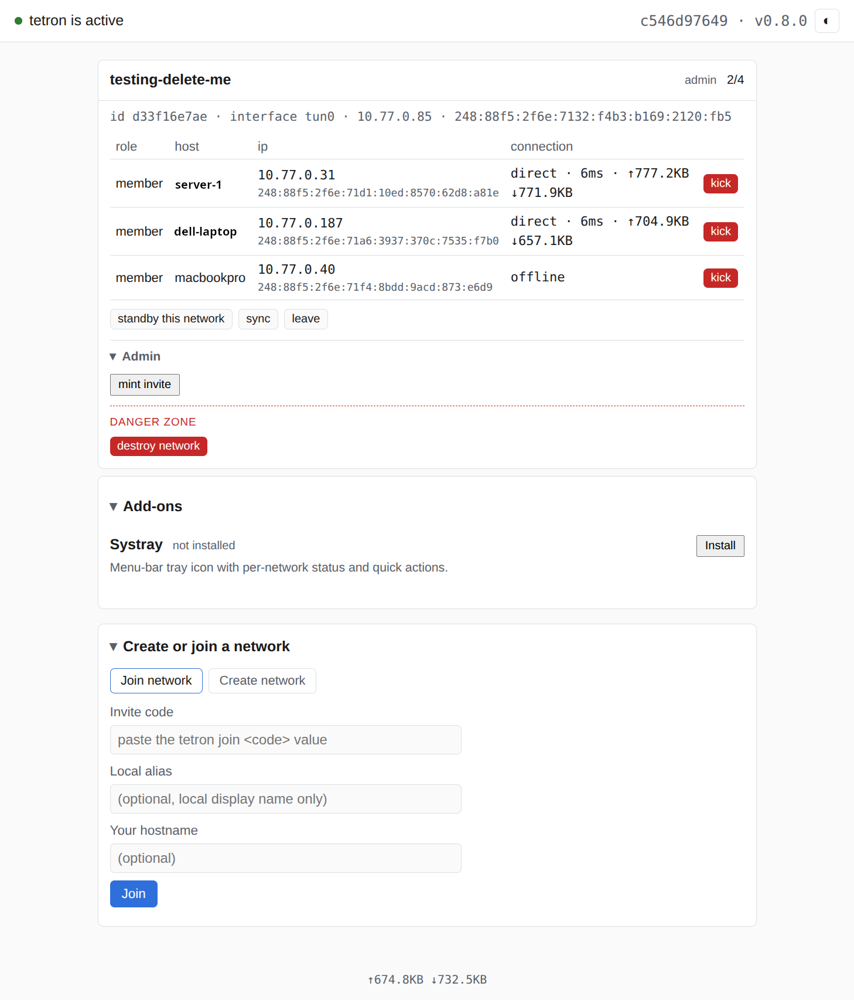

# tetron-webui

A browser dashboard and admin console for [tetron](https://github.com/ErikAllanKincaid/tetron), a P2P mesh VPN. Talks to the existing `tetron` daemon over its Unix-socket IPC protocol — no daemon changes required.

**Optional and separate from tetron on purpose.** tetron itself follows the Unix "do one thing well" philosophy and stays CLI-only by default; `tetron-webui` is a genuinely separate, opt-in product for anyone who wants a browser interface, not a bundled or default-installed component. Nothing about tetron's own behavior changes whether this exists or not.



## Running it

**Primary path: download a pre-built binary.**

```bash
# First install tetron daemon.
curl -Lo tetron https://github.com/ErikAllanKincaid/tetron/releases/latest/download/tetron-linux-x86_64
chmod +x tetron
sudo install tetron /usr/local/bin/tetron
sudo tetron install

# Linux x86_64 -- see the releases page for aarch64 / macOS binaries:
# https://github.com/ErikAllanKincaid/tetron-webui/releases/latest
curl -Lo tetron-webui https://github.com/ErikAllanKincaid/tetron-webui/releases/latest/download/tetron-webui-linux-x86_64
chmod +x tetron-webui
sudo install tetron-webui /usr/local/bin/tetron-webui

tetron-webui install     # sets up + starts a per-user service, no sudo needed for this step
```

Installs a `systemd --user` unit on Linux (`~/.config/systemd/user/tetron-webui.service`) or a launchd **LaunchAgent** on macOS (`~/Library/LaunchAgents/com.tetron.webui.plist`, distinct from a system-wide LaunchDaemon — this runs inside your login session, not root). `Restart=on-failure`/`KeepAlive` means it comes back automatically if it crashes. `install` points the service at whatever binary you ran it from — install it somewhere permanent first (as above) if you want the service to survive that binary being deleted. `tetron-webui uninstall` stops and removes it. Verified end to end on real hardware on both platforms: install, crash-recovery (`kill -9` the process, confirmed the service manager restarts it within seconds), and uninstall all leave the machine clean.

Then open `http://127.0.0.1:7870`. Requires a running `tetron` daemon (`sudo tetron install`) reachable at its usual Unix socket. Read-only status works for any local user; mutating actions (create/join/leave/kick/nuke/etc.) require the browsing user to be tetron's configured operator (`sudo tetron set-operator <user>`) or root — same authorization model the CLI uses.

### Building from source / development

```bash
cargo build --release   # or: cargo run, for a foreground dev run
```

Only needed if you're changing the code, or a pre-built binary isn't published for your platform yet.

## What it does

- Live dashboard: which networks you're on, per-member role/host/IP/IPv6/connection health, traffic stats.
- Network lifecycle: create (including the nuke-consensus threshold), join, leave.
- Per-network resume/standby, and a manual sync button to wake the DHT/group poller immediately.
- Invites: mint, list, revoke — minting (including the one auto-minted on network creation) shows the key as a scannable QR code, not just raw text.
- Coordinator actions: kick a member, grant/list co-coordinators, destroy a network (with the same consensus/force safeguards the CLI has).
- Add-ons panel: detect, install, and uninstall optional tetron add-ons directly from the dashboard — [`tetron-systray`](https://github.com/ErikAllanKincaid/tetron-systray) (a menu-bar tray icon) is the first one, and this is now its recommended install path. Verified end to end on real hardware, both platforms: a fresh install renders a working tray icon on Linux and macOS, and re-installing over an already-running instance (e.g. an upgrade) cleanly restarts it instead of leaving the old binary in memory. [`tetron-relay`](https://github.com/ErikAllanKincaid/tetron-relay) (self-hosted relay bringup) and [`tetron-testsuite`](https://github.com/ErikAllanKincaid/tetron-testsuite) (VM-based test suite) are also listed, as reference rows linking to their own repos — neither is a single-binary local service, so there is nothing for this webui to install for them.

## Upgrading

Re-run the same install steps with a fresh binary:

```bash
curl -Lo tetron-webui https://github.com/ErikAllanKincaid/tetron-webui/releases/latest/download/tetron-webui-linux-x86_64
chmod +x tetron-webui
sudo install tetron-webui /usr/local/bin/tetron-webui   # overwrite the old binary at the same path
tetron-webui install                                     # re-registers the service and restarts it on the new binary
```

`install` is idempotent and safe to run over an already-running instance, it rewrites the unit/plist (in case the binary path changed) and explicitly restarts the service, so the new binary takes over immediately rather than waiting for the next reboot or a manual kill.

**No required order relative to the `tetron` daemon or `tetron-systray`.** The IPC wire format (`tetron-proto`) is deliberately tolerant of version skew — every message field is `#[serde(default)]`, so an older webui talking to a newer daemon just doesn't see fields it doesn't know about yet, and a newer webui talking to an older daemon sees defaults for anything the daemon hasn't started sending. There is no version handshake and nothing to break by upgrading webui before, after, or independently of the daemon. (This is a different, much more tolerant contract than the mesh peer-to-peer protocol between `tetron` daemons themselves, which is a hard ALPN version gate — see `tetron`'s own `AGENTS.md` if you're wondering why that one *does* need synchronized upgrades and this doesn't.)

If a `tetron-proto` change actually adds a capability you want to use (a new field, a new IPC op), you need the matching webui release that was built against it — check `tetron-webui`'s own releases page. webui's version number tracks tetron core's current minor (e.g. webui `0.9.x` targets tetron `0.9`), so matching the daemon's minor version is a reasonable rule of thumb if you want to be sure you're not missing something, even though it isn't strictly required for things to keep working.

## Uninstalling

```bash
tetron-webui uninstall
```

Stops and removes the `systemd --user` unit (`~/.config/systemd/user/tetron-webui.service` on Linux) or launchd LaunchAgent (`~/Library/LaunchAgents/com.tetron.webui.plist` on macOS). **Deliberately leaves the binary itself in place** (wherever you installed it — `/usr/local/bin/tetron-webui` if you followed the install steps above): `uninstall` only knows how to tear down the service it registered, not delete its own currently-running executable. Remove it yourself if you want it fully gone:

```bash
sudo rm /usr/local/bin/tetron-webui
```

**Logs are also left in place**, on both platforms: Linux writes to the systemd user journal (`journalctl --user -u tetron-webui`), which isn't a file this project owns and ages out via your system's normal journal retention; macOS writes to `~/Library/Logs/tetron-webui.log`, a plain file you can delete by hand if you want.

**If you only ever ran `cargo run` (or the bare binary) in a terminal and never ran `tetron-webui install`**, there's no service to remove at all — nothing was ever registered with `systemctl`/`launchctl`. Just stop the terminal process (Ctrl-C).

## Architecture

```
Browser --HTTP (127.0.0.1 only)--> tetron-webui --msgpack/Unix socket--> tetron daemon
```

No daemon-side changes. Depends on `tetron-proto` (tetron's shared wire-protocol crate) as a git dependency, floating on `main` rather than pinned to a release tag — see the comment in `Cargo.toml` for why.

The invite QR code is generated entirely client-side — `static/vendor/qrcode.js` vendors [kazuhikoarase/qrcode-generator](https://github.com/kazuhikoarase/qrcode-generator) (MIT license, unmodified, see the file's own header) so no invite secret ever needs a round trip anywhere beyond the browser tab that already has it.

## Building your own version of this

**[`docs/HOWTO_Build_A_WebUI.md`](docs/HOWTO_Build_A_WebUI.md)** — a generic, instructional writeup of the pattern this is built on (a thin HTTP server proxying a browser to a local daemon's IPC socket, with a static framework-free frontend), with real references and worked examples from this repo's own source. Useful if you're building something similar, not just historical context for this one project.

## License

MPL-2.0, matching tetron itself.
